<pre align="center">Binaries uploading soon. Your patience is appreciated</pre>

#   WearGPT

  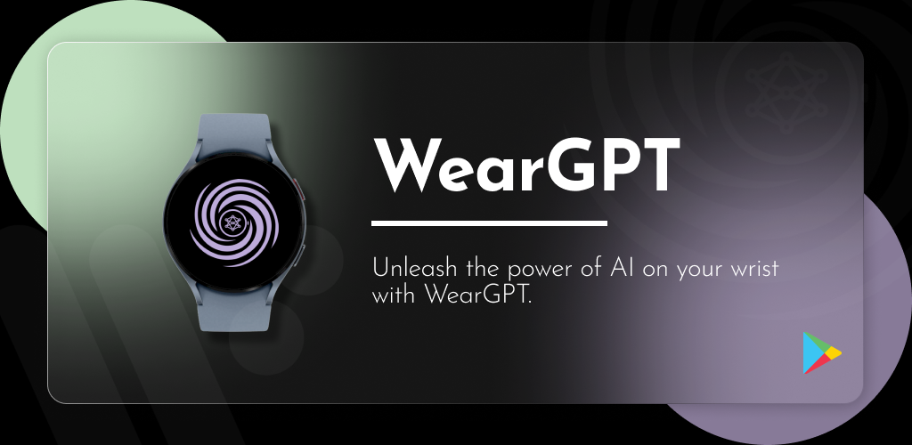

<a href="https://play.google.com/store/apps/details?id=com.muthadevelopers.weargpt">

  

  
<a> 
| 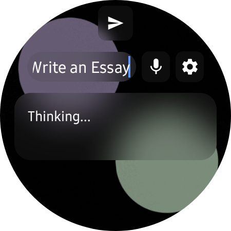 | 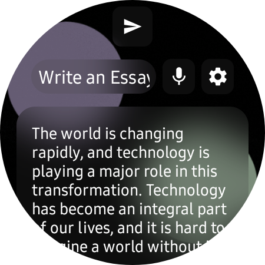 | 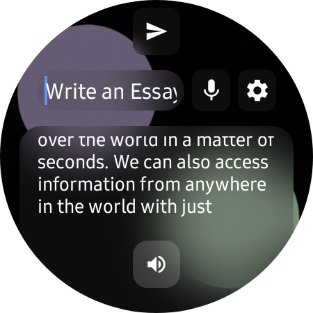 |
| 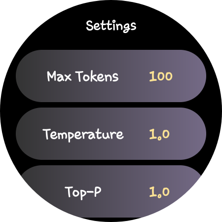 | 
 |-----------|------------|------------|--------------| 
  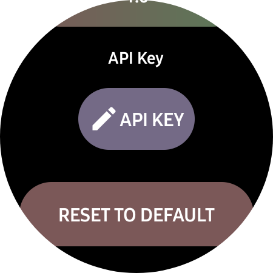 | 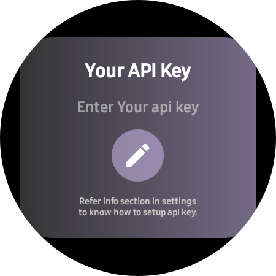 |
| 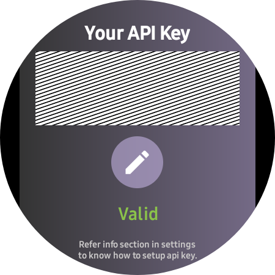 | 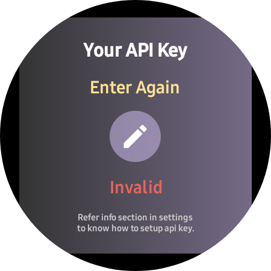 | 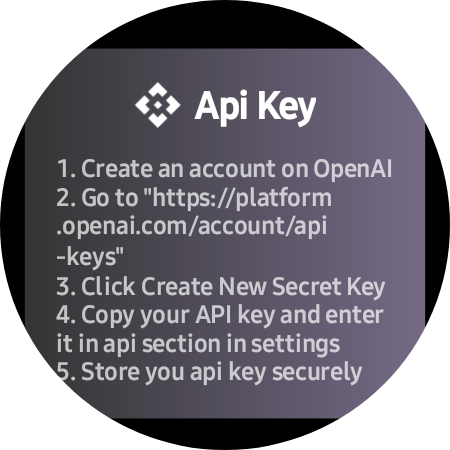 |
|  |  |  |

  
Experience OpenAI's GPT Model on your wrist with WearGPT.

WearGPT is an innovative smartwatch app that allows users to access the advanced language processing capabilities of Open AI's GPT Model directly from their wrist. With WearGPT, you can easily ask questions, get instant answers, make quick calculations, and more - all without having to pull out your phone or open a browser.

Whether you're on the go or just prefer the convenience of using your smartwatch, WearGPT provides a seamless experience that allows you to access ChatGPT's impressive language processing capabilities at any time. The app is designed specifically for WearOS, Google's operating system for wearable devices, and is optimized to work smoothly on a variety of smartwatches.

WearGPT is perfect for anyone who needs quick answers to questions or wants to perform calculations without having to fumble with their phone. It's also great for people who prefer the convenience of using their smartwatch.

With WearGPT, you can enjoy the benefits of ChatGPT's powerful language processing capabilities on your smartwatch. Simply speak your query/prompts or type it using your smartwatch's keyboard, and WearGPT will provide you with a quick response. Whether you need help with a math problem or just want to know any sort of information, WearGPT has got you covered.

Overall, WearGPT is a must-have app for anyone who wants to access ChatGPT's advanced language processing capabilities directly from their smartwatch. It's easy to use, convenient, and provides quick and accurate responses to all your queries.

# Features 
<li>Access to ChatGPT's advanced AI language model on Wear OS devices</li>
<li>Voice input and output functionality for hands-free communication</li>
<li>Customizability through app settings to adjust header parameters and model to match user preferences and needs</li>
<li>Seamless integration with other Wear OS devices for easy use and access</li>
<li>Ability to seek answers to complex questions and engage in casual question and answering</li>
<li>Quick code template or segment suggestions for developers</li>
<li>Mathematical expression solving capabilities</li>
<li>Suggestions and advice for given prompts such as new product launch descriptions or store listing ideas</li>
<li>Generation of context for short subjective emails</li>
<li>Endless use cases for creative and personalized experiences</li>

# Usage  
<pre align="center">You will need to generate and use your own API Key from OpenAI </pre>
## Instructions
<li>1. Go to OpenAI(https://openai.com/) and create an account</li>
<li>2. Click on personal and then on "view API Keys"</li> 

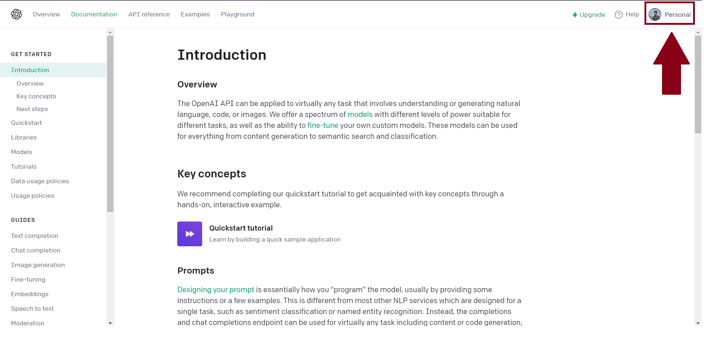

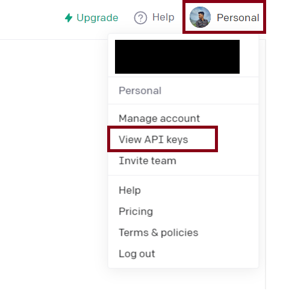

<li>3. Click on "create a new secret key"</li> 

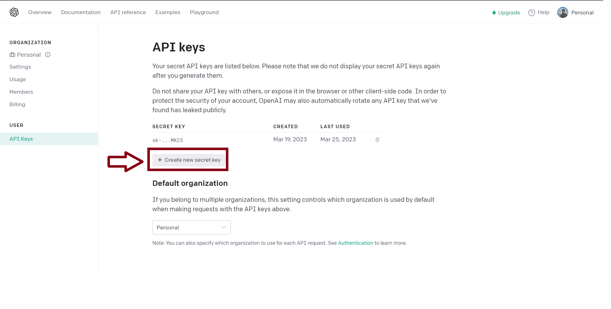

<li>4. Copy and store the secret key in a safe place</li> 

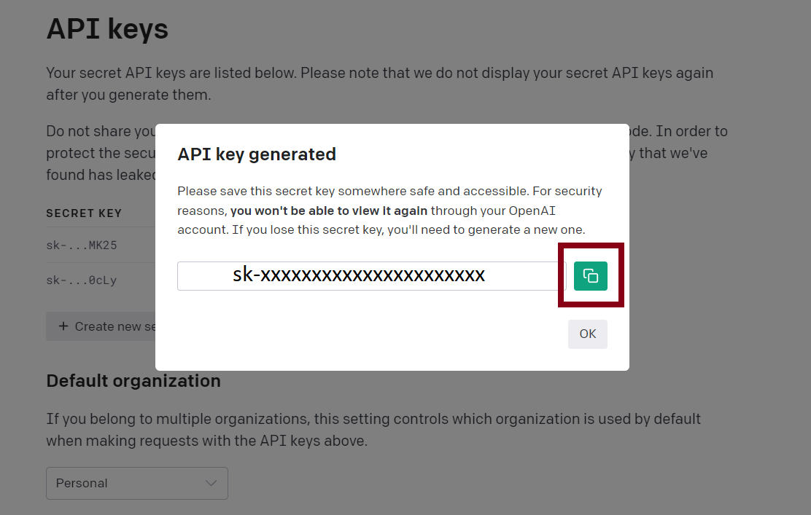

<li>5. Click on modify API button in app settings in your watch</li> 

<li>6.Click on edit button and then Manually enter the API key in the given field</li> 

<li>7. After entering the API key, click "done/tick" button of the keyboard.</li> 

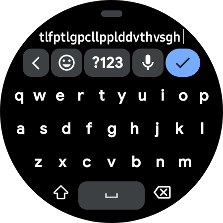

<li>8. After entering the API key, wait until the API key is validated and either "valid" or "invalid" text appears</li> 

<li>9. Done, Now you can use the app to make prompts and get response.</li> 
<pre align="center">Before setting the API Key to watch, make sure you account has enough credits granted by OpenAI. you can check this under "view api usage" tab of OpenAI website</pre>

## Privacy Policy
You can view our privacy policy [here](https://github.com/AnujMutha/WearGPT/blob/main/PRIVACY_POLICY.md).

## License 
Apache License. 
Version 2.0, January 2004 
http://www.apache.org/licenses/
